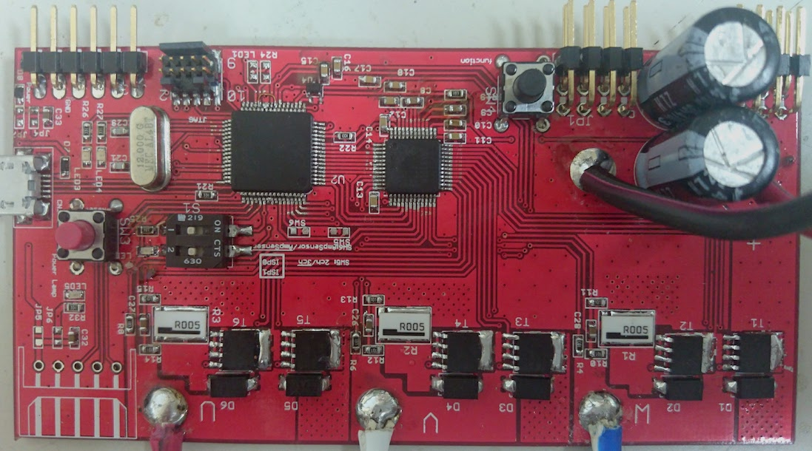

# 三相BLDCモータドライバ  

## 概要  
ロボコンでの使用を目的とした三相ブラシレスモータドライバの開発を行う。  
  
## 主な機能  
* 過電流保護  
* 電流センサを用いた電流制御  
* 内臓のホールセンサを用いた低速域での制御  
* USBを用いたシェルの実装  
  
## 開発環境  
### ソフト  
* lpcxpresso (NXP Semiconductor, 統合開発環境)  
* SourceTree (Atlassian, Git管理ツール)  
* Eagle (回路エディタ)  
  
### 言語  
* GNU C++ 14
* GNU C 11  

## 基板概要  
* ARMマイコン  
* 電流センサを備えたゲートドライバ  
* DIPスイッチによるブートセレクタ
  

  
